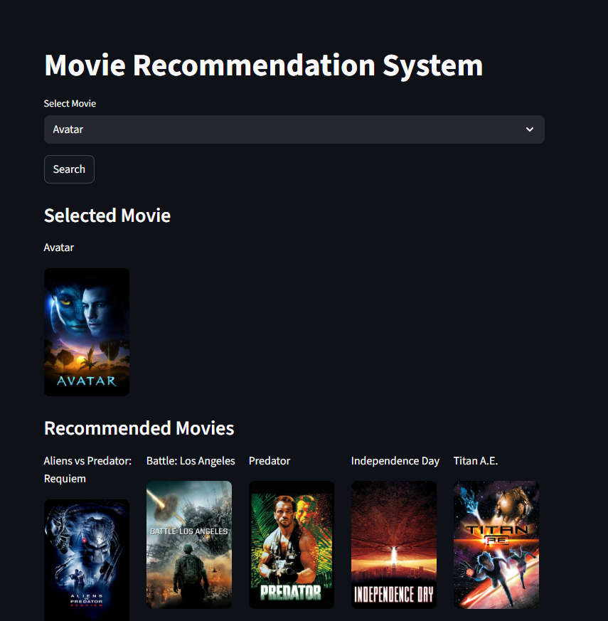
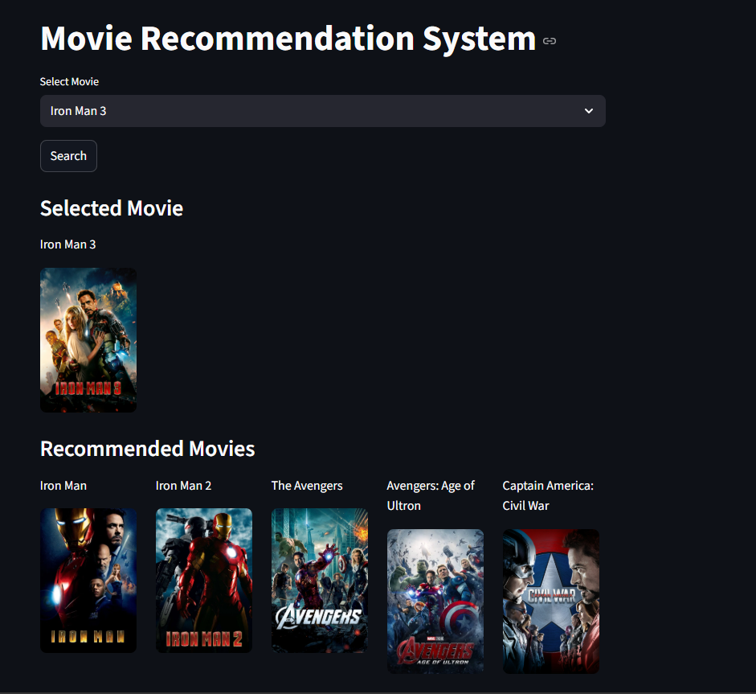
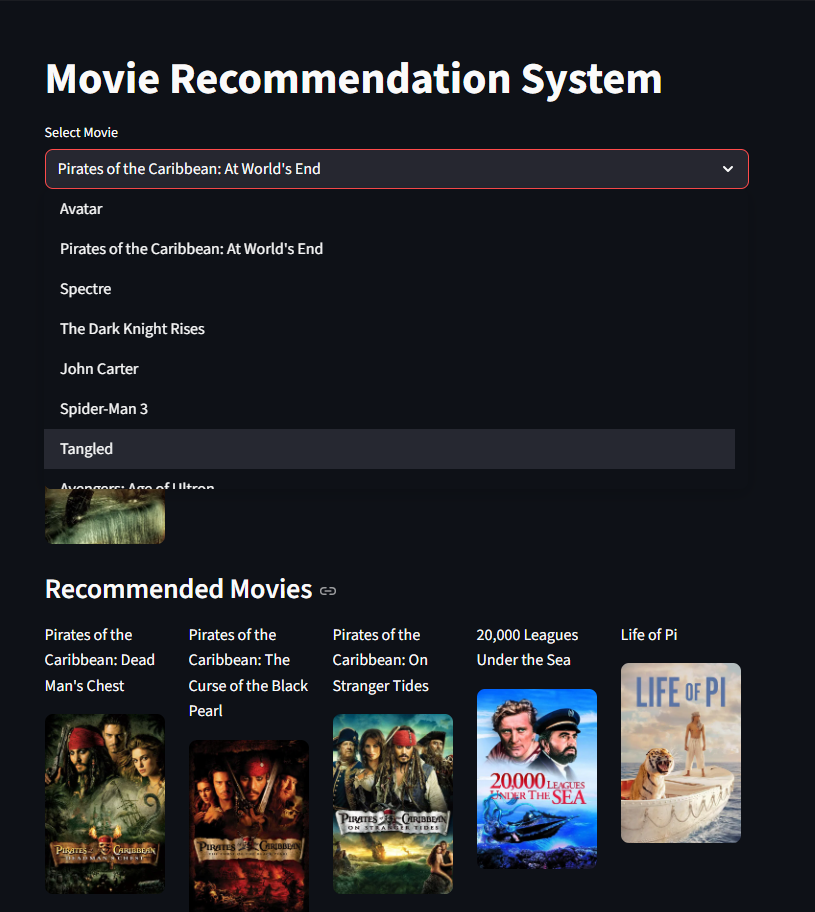

### Movie Recommendation System

A Content-Based Movie Recommendation System built using Python, Scikit-learn, and Streamlit. The system recommends movies similar to the selected movie based on their features such as genres, keywords, cast, crew, and overview. Movie posters are fetched dynamically using the TMDB API.

### Features

-> Recommend movies based on content similarity.

-> Interactive web interface using Streamlit.

-> Displays movie posters using TMDB API.

-> Fast recommendations using Cosine Similarity.

-> User-friendly dropdown for movie selection.

### Tech Stack Used

Python
Pandas
NumPy
Scikit-learn
Streamlit
TMDB API
Joblib

### Demos
Demo1:

Demo2:

Demo3:

### Future Improvements
-> Collaborative Filtering Recommendation System

-> Hybrid Recommendation System

-> User Authentication

-> Search by Actor or Genre

-> Movie Ratings and Reviews

### To run locally on your device

-> Clone the repository:

git clone https://github.com/AayushAcharya12/Movie-Recommendation-System.git

-> Move into the project directory:

cd Movie-Recommendation-System

-> Install dependencies:

pip install -r requirements.txt

-> Run the Streamlit app:

streamlit run App/app.py

### Live App Is Hosted In Streamlit Cloud

-> Link="https://movie-recommendation-system-jpzceenwjcj8k2qozuhzfd.streamlit.app/"
